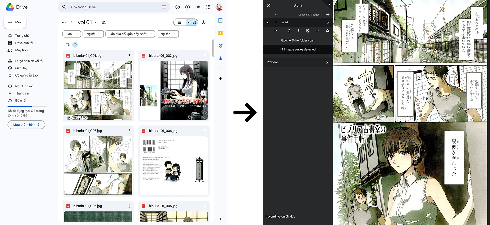
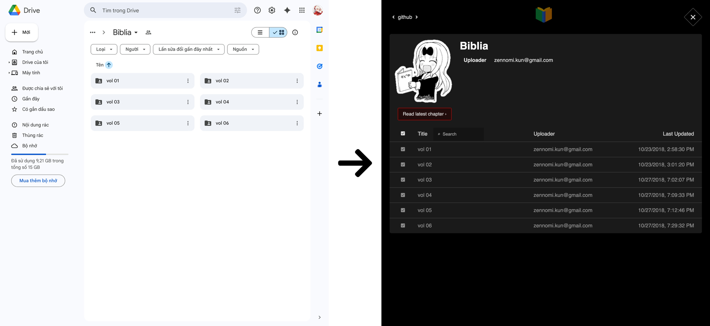

# TruyenDrive

TruyenDrive là một userscript giúp biến các thư mục trên Google Drive thành một giao diện đọc truyện tranh chuyên nghiệp và tiện lợi.





Thay vì phải mở từng ảnh một cách thủ công trên Google Drive, TruyenDrive sẽ tự động nhận diện các thư mục chứa ảnh hoặc các thư mục con (các chương truyện), sau đó hiển thị chúng dưới dạng một trình đọc truyện với đầy đủ các tính năng như chuyển trang, thiết lập hiển thị, và lưu lại lịch sử đọc.

## Tính năng chính

- **Giao diện đọc truyện tối ưu**: Hỗ trợ đọc từ trái sang phải (LTR), phải sang trái (RTL) hoặc cuộn dọc (TTB).
- **Tự động nhận diện cấu trúc**: Phân tích cấu trúc thư mục Google Drive để phân loại thành danh sách chương hoặc danh sách trang ảnh. Hỗ trợ cả Shortcut của Google Drive.
- **Tùy chỉnh linh hoạt**: Hỗ trợ thay đổi chế độ hiển thị trang (trang đơn, trang đôi), tự động tải trước trang ảnh (preload) để tránh giật lag, và lưu lại cài đặt của người dùng.
- **Tiện lợi**: Có thanh bên (sidebar) và các nút điều hướng trực quan mang lại trải nghiệm tương tự các trang web đọc truyện lớn.
- **Lưu lại trạng thái đọc**: TruyenDrive sẽ lưu lại trạng thái đọc của người dùng (chương và trang hiện tại) trong URL, giúp người dùng có thể tiếp tục đọc từ nơi đã dừng lại khi mở lại trang.

## Hướng dẫn cài đặt

Để sử dụng TruyenDrive, bạn cần cài đặt một tiện ích mở rộng giúp chạy userscript trên trình duyệt, phổ biến nhất là **Tampermonkey**.

### Bước 1: Cài đặt Tampermonkey extension

**Tải Tampermonkey**: [https://www.tampermonkey.net/](https://www.tampermonkey.net/)

Hoặc dùng các url trực tiếp dưới đây:

#### Desktop

- **Google Chrome / Microsoft Edge / Cốc Cốc**: Cài đặt từ [Chrome Web Store](https://chromewebstore.google.com/detail/tampermonkey/dhdgffkkebhmkfjojejmpbldmpobfkfo).
- **Mozilla Firefox**: Cài đặt từ [Firefox Add-ons](https://addons.mozilla.org/vi/firefox/addon/tampermonkey/).

#### Mobile

> coming soon

### Bước 2: Cài đặt Userscript TruyenDrive

1. Mở liên kết đến script:
   [https://raw.githubusercontent.com/zennomi/truyendrive/release/truyendrive-userscript.user.js](https://raw.githubusercontent.com/zennomi/truyendrive/release/truyendrive-userscript.user.js)

2. Tampermonkey sẽ tự động bắt link và mở ra một trang xác nhận.
3. Nhấn vào nút **Install** (Cài đặt) để hoàn tất.

## Cách sử dụng

### Người đọc

1. Truy cập vào bất kỳ thư mục Google Drive (VD: `https://drive.google.com/drive/folders/...`) chứa:

- Các trang truyện
- Hoặc chứa các thư mục con (mỗi thư mục con là một chương truyện)

2. Bấm vào nút "TruyenDrive" ở góc dưới cùng bên phải để kích hoạt giao diện đọc truyện của TruyenDrive.


3. Nếu thư mục vừa có chứa ảnh (trang truyện) vừa chứa thư mục con (chương truyện), một hộp thoại sẽ hiện ra để bạn chọn cách mở.
4. Trong màn hình đọc truyện, bạn có thể:
   - Click vào hai bên mép màn hình, hoặc dùng phím mũi tên trái/phải để **Chuyển trang**.
   - Click vào giữa màn hình để mở/đóng thanh công cụ.
   - Sử dụng thanh công cụ hoặc sidebar để **chuyển chương**, phóng to/thu nhỏ, hay thay đổi các cài đặt khác theo sở thích.

### Nhóm dịch

Để trải nghiệm đọc truyện tốt nhất, bạn nên tổ chức thư mục Google Drive theo cấu trúc sau:

```
- One Piece
  - Chương 1
    - Trang 1.jpg
    - Trang 2.jpg
    - ...
  - Chương 2
    - Trang 1.jpg
    - Trang 2.jpg
    - ...
```

TruyenDrive sẽ tự động nhận diện các thư mục con và hiển thị chúng dưới dạng các chương truyện, sắp xếp từ A-Z, support tất cả các format ảnh: JPG, PNG, WEBP và thậm chí PSD.

[Ví dụ 1 link chương truyện](https://drive.google.com/drive/u/2/folders/1lzc-aJ0sEl5J_a4xCsSyLpRn5ABQjxRm?truyendrive-chap=15PTiht-fQjeKeP9RQ_ggokYna1fVoe1o&truyendrive-page=1m).

Để chia sẻ một chương truyện là thư mục con của một truyện, chia sẻ link với format sau: `https://drive.google.com/drive/folders/[manga-folder-id]?truyendrive-chap=[chapter-folder-id]&truyendrive-page=1`

Hoặc copy link trực tiếp tại giao diện đọc truyện.
