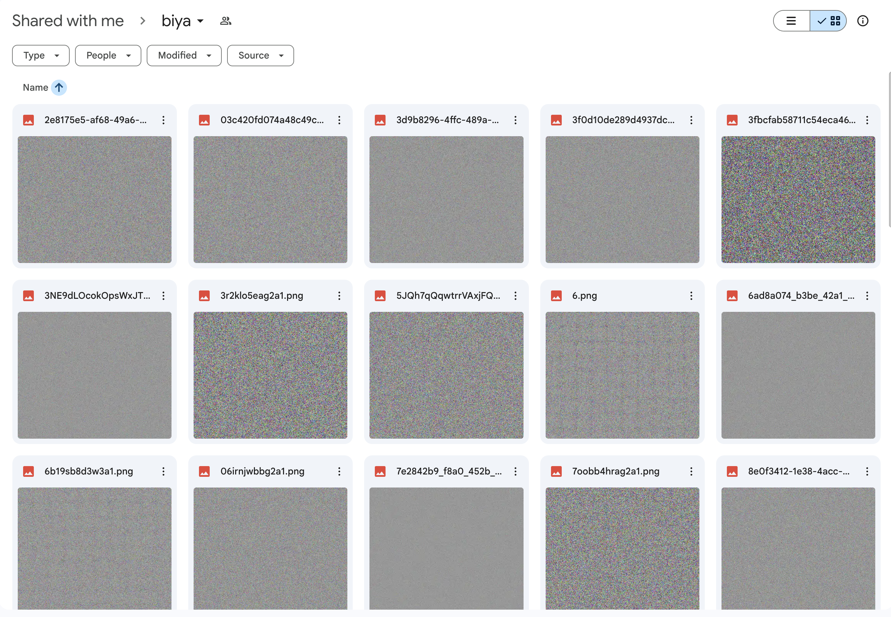
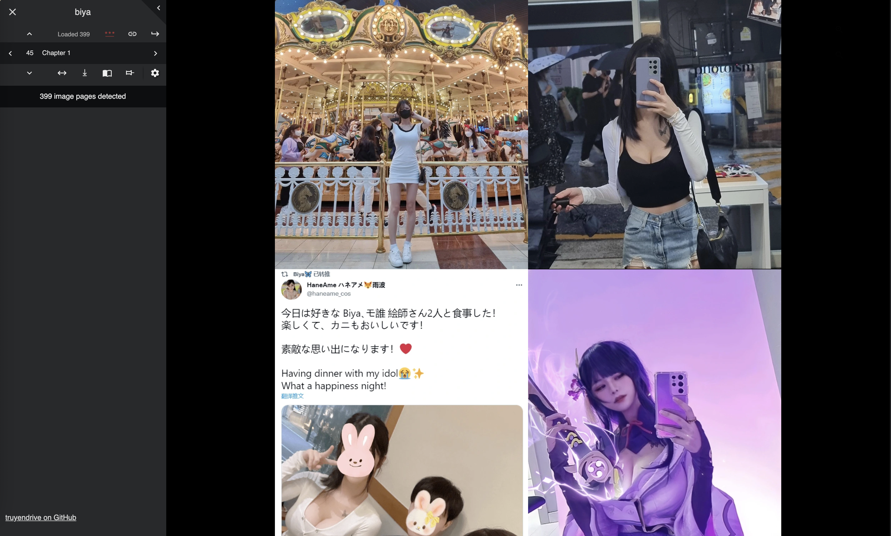
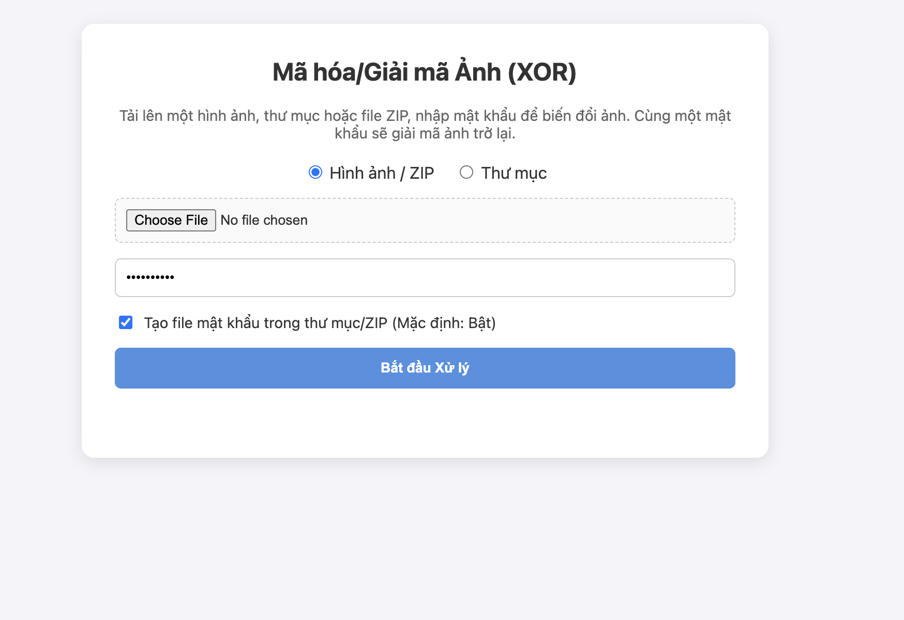

# Hướng dẫn mã hóa (Encode) hình ảnh

Dành cho các uploader, TruyenDrive hỗ trợ tính năng mã hóa hình ảnh để tăng cường tính riêng tư cho dữ liệu lưu trữ hoặc yêu cầu người đọc phải nhập mật khẩu mới có thể xem được truyện. Lưu ý khi bật chế độ này, trải nghiệm đọc truyện sẽ không nhanh như trước.



_Ví dụ trên là trước khi decode, bạn có thể thấy rằng các hình ảnh đã được mã hóa và không thể xem được._



_Ví dụ trên là sau khi decode, bạn có thể thấy rằng các hình ảnh đã được giải mã và có thể xem được._

Có 2 phương pháp để thực hiện việc này tùy thuộc vào nhu cầu của bạn:

## 1. Phương pháp đơn giản (Dành cho người dùng phổ thông)

Sử dụng công cụ mã hóa trực tuyến trên trình duyệt (Web Encoder). Phù hợp khi bạn cần xử lý số lượng ít hoặc không quen sử dụng dòng lệnh.

- **Truy cập công cụ:** [https://zennomi.github.io/truyendrive/encoder.html](https://zennomi.github.io/truyendrive/encoder.html)
- **Cách thực hiện:**
  1. Mở trang web trên bằng trình duyệt của bạn.
  2. Kéo thả hoặc chọn các hình ảnh bạn muốn mã hóa (trong 1 file zip/1 folder).
  3. **Mật khẩu:** Nhập mật khẩu bạn muốn dùng để bảo vệ file.
  4. **Tạo file mật khẩu:** Khi có file này trong folder, khi tải lên Drive, ảnh sẽ tự động được giải mã, không cần nhập mật khẩu thủ công.
  5. Nhấn nút mã hóa và tải về các file đã được xử lý (được lưu dưới dạng `.truyendrive`).
  6. Tải các file này lên Google Drive hoặc OneDrive.



## 2. Phương pháp dành cho nhà phát triển (Dành cho uploader chuyên nghiệp)

Sử dụng công cụ dòng lệnh (CLI) để xử lý hàng loạt hình ảnh một cách tự động và nhanh chóng. Phù hợp cho các uploader lớn, cần xử lý hàng trăm hoặc hàng nghìn file ảnh.

- **Truy cập mã nguồn và hướng dẫn CLI:** [https://github.com/zennomi/truyendrive-cli](https://github.com/zennomi/truyendrive-cli)
- **Cách thực hiện (Tóm tắt):**
  1. Yêu cầu máy tính đã cài đặt môi trường **Node.js**.
  2. Mở Terminal (hoặc Command Prompt) và chạy lệnh CLI theo hướng dẫn trên kho lưu trữ Github.
  3. Tool này hỗ trợ quét và mã hóa tự động toàn bộ hình ảnh trong một thư mục lớn chỉ với một câu lệnh.

```bash
➜  ~ npx truyendrive-cli@latest ~/biya
biya [██████████████████░░░░░░░░░░░░░░░░░░░░░░] 175/400 (44%)
```

Để xem chi tiết các câu lệnh và tham số hỗ trợ (ví dụ như đặt mật khẩu, tùy chỉnh định dạng đầu ra, v.v.), vui lòng tham khảo trực tiếp tại trang Github của `truyendrive-cli`.
