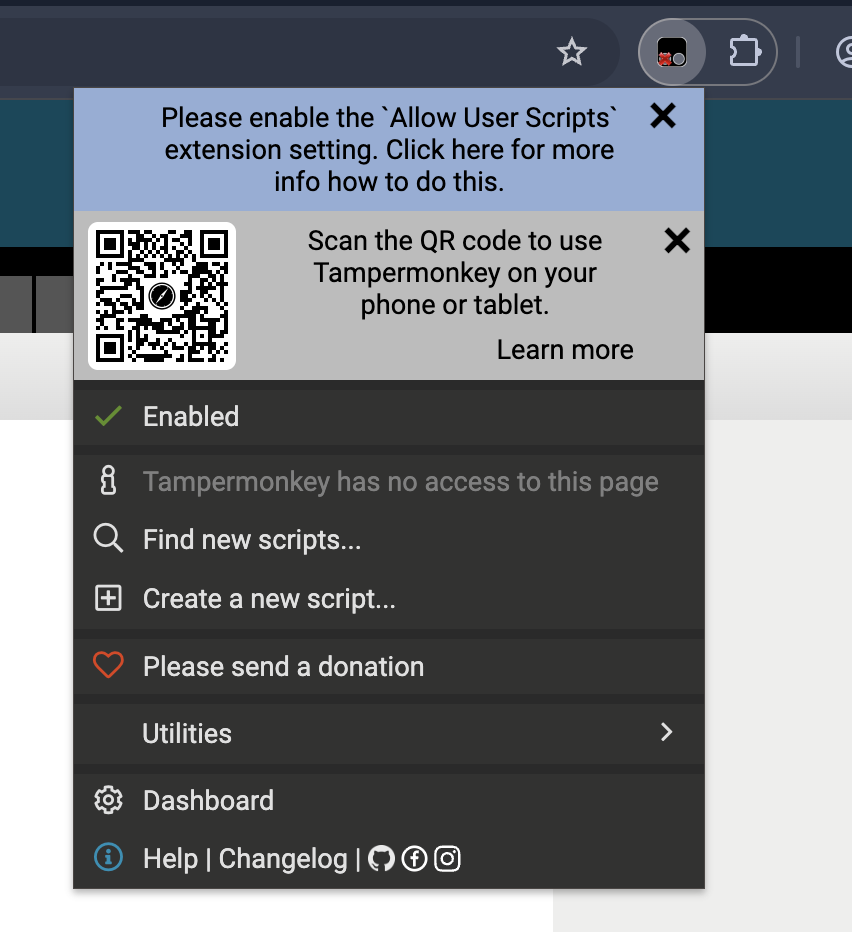
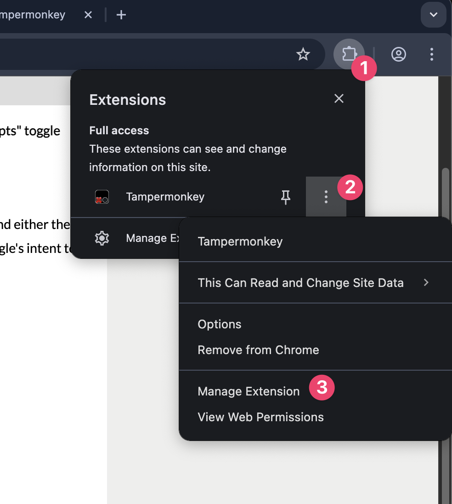
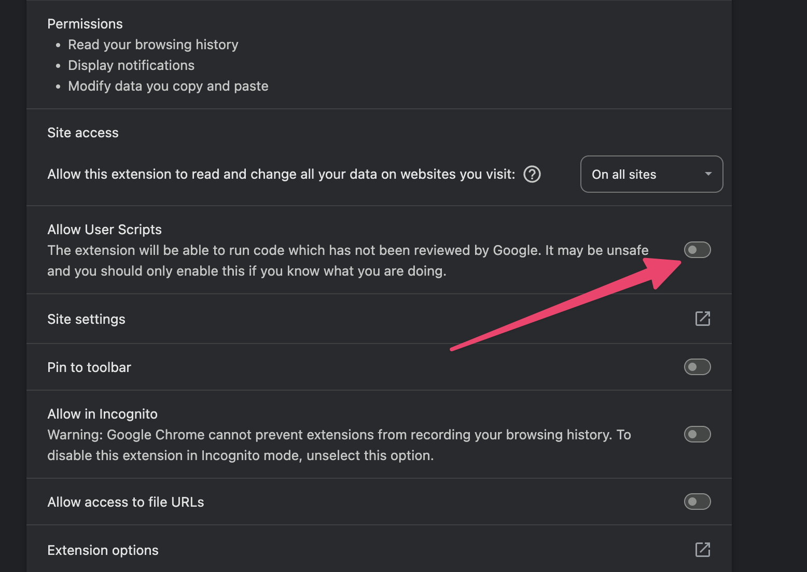
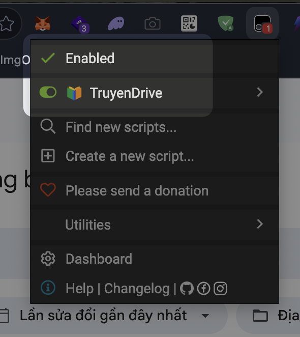

# Hướng dẫn cài đặt TruyenDrive

Để sử dụng TruyenDrive, bạn cần cài đặt một ứng dụng hoặc tiện ích mở rộng giúp chạy userscript trên trình duyệt. Dưới đây là hướng dẫn chi tiết cho từng nền tảng.

## 1. Dành cho Desktop (Máy tính)

Phổ biến nhất trên Desktop là sử dụng tiện ích **Tampermonkey**.

### Bước 1: Cài đặt Tampermonkey extension

**Tải Tampermonkey**: [https://www.tampermonkey.net/](https://www.tampermonkey.net/)

Hoặc dùng các link tải trực tiếp dưới đây:
- **Google Chrome / Microsoft Edge / Cốc Cốc**: Cài đặt từ [Chrome Web Store](https://chromewebstore.google.com/detail/tampermonkey/dhdgffkkebhmkfjojejmpbldmpobfkfo).
- **Mozilla Firefox**: Cài đặt từ [Firefox Add-ons](https://addons.mozilla.org/vi/firefox/addon/tampermonkey/).

#### Lưu ý với người lần đầu cài đặt Tampermonkey
Lần đầu cài đặt Tampermonkey, ở icon của Tampermonkey sẽ hiện ra một cái chữ "X" đỏ, bạn cần thao tác khác để kích hoạt Tampermonkey.

- Bấm vào icon của Tampermonkey.
- Chọn dấu 3 chấm hoặc chuột phải vào icon của Tampermonkey.
- Chọn "Manage Extension" (Quản lý).

- Bật Allow Userscripts

Hướng dẫn chi tiết hơn [tại đây](https://www.tampermonkey.net/faq.php?q=Q209#Q209).

### Bước 2: Cài đặt Userscript TruyenDrive

1. Mở liên kết đến script:
   [https://zennomi.github.io/truyendrive/truyendrive-userscript.user.js](https://zennomi.github.io/truyendrive/truyendrive-userscript.user.js)
2. Tampermonkey sẽ tự động bắt link và mở ra một trang xác nhận.
3. Nhấn vào nút **Install** (Cài đặt) để hoàn tất.

### Bước 3: Kiểm tra

Mở 1 trang Google Drive và bấm vào icon Tampermonkey để kiểm tra xem TruyenDrive đã được cài đặt thành công hay chưa. Như ảnh dưới đây là đã thành công.

Ngoài ra sẽ có 1 nút TruyenDrive ở góc dưới cùng bên phải của trang Google Drive.

## 2. Dành cho thiết bị iOS (iPhone / iPad)

Để chạy userscript trên iOS, bạn có thể sử dụng ứng dụng **Userscripts** kết hợp với trình duyệt **Safari**.

### Bước 1: Cài đặt ứng dụng Userscripts
Tải và cài đặt ứng dụng **Userscripts** từ App Store.

### Bước 2: Kích hoạt phần mở rộng trên Safari
1. Mở **Cài đặt** (Settings) trên iOS.
2. Tìm và chọn **Safari** > **Phần mở rộng** (Extensions).
3. Chọn **Userscripts** và bật nó lên. Đảm bảo cấp quyền truy cập vào các trang web (All Websites).

### Bước 3: Cài đặt script TruyenDrive
1. Mở ứng dụng **Userscripts**, chọn thư mục để lưu trữ các script của bạn.
2. Mở trình duyệt Safari và truy cập vào link: [https://zennomi.github.io/truyendrive/truyendrive-userscript.user.js](https://zennomi.github.io/truyendrive/truyendrive-userscript.user.js)
3. Ứng dụng Userscripts sẽ nhận diện và cho phép bạn tải về/cài đặt script này.

## 3. Dành cho thiết bị Android

Trên Android, bạn không thể cài đặt extension trực tiếp lên Google Chrome, vì vậy có 2 phương pháp phổ biến:

### Phương pháp 1: Sử dụng Kiwi Browser (Khuyên dùng)
Kiwi Browser là một trình duyệt dựa trên Chromium có hỗ trợ cài đặt extension giống hệt trên máy tính.

1. Tải và cài đặt **Kiwi Browser** từ Google Play Store.
   
2. Mở Kiwi Browser, truy cập Chrome Web Store và cài đặt extension **Tampermonkey** tương tự như trên Desktop.
3. Nhấp vào link tải script: [https://zennomi.github.io/truyendrive/truyendrive-userscript.user.js](https://zennomi.github.io/truyendrive/truyendrive-userscript.user.js)
4. Xác nhận cài đặt trong Tampermonkey.

### Phương pháp 2: Sử dụng Firefox cho Android
Firefox trên Android hỗ trợ một số extension được chọn lọc, trong đó có Tampermonkey.

1. Tải và cài đặt **Firefox** từ Google Play Store.
   
2. Mở menu của Firefox (dấu 3 chấm), chọn **Tiện ích mở rộng** (Add-ons).
3. Tìm và cài đặt **Tampermonkey**.
4. Truy cập vào link script: [https://zennomi.github.io/truyendrive/truyendrive-userscript.user.js](https://zennomi.github.io/truyendrive/truyendrive-userscript.user.js) để tiến hành cài đặt.

